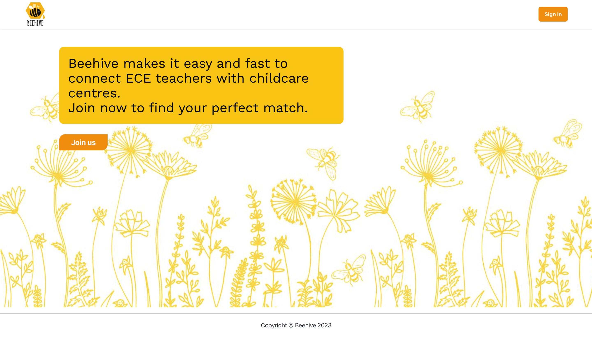

<!--  -->

# Beehive

Beehive is a powerful web application designed to facilitate seamless connections between early childhood teachers and centers. It offers a wide range of features that empower centers and teachers to connect, collaborate, and find the perfect match for their needs.

## Key Features for Centers

**• Sign up and Sign in:** Centers can easily create an account and access their dashboard using their email and password.

**• Manage Center Profile:** Centers can enhance their profile by uploading an image and providing a detailed description.

**• Post Job Listings:** Centers can create job posts by specifying the date range, time range, and other specific requirements.

**• Receive Teacher Applications:** Centers receive instant notifications when teachers apply for job listings. They can view the teacher's profile and accept applications accordingly.

**• Efficient Job Management:** Centers can easily manage their job listings and applications using a convenient calendar-based interface.

## Key Features for Teachers

**• Sign up and Sign in:** Teachers can quickly register and log in to the platform using their email and password. 

**• Update Personal Profile:** Teachers can personalize their profile by uploading an image and adding a biography.

**• Job Notifications:** Teachers receive timely notifications when centers post job listings on their available days. They can review the center's profile and choose to apply or decline the job.

**• Job Details and Tracking:** Teachers can view comprehensive job details and track their applications using an intuitive calendar-based interface.

## Tech stack

**• Next.js:** A popular React framework for server-side rendering and efficient front-end development.

**• TypeScript:** Provides type safety and enhanced developer productivity.

**• Tailwindcss:** A utility-first CSS framework for rapid and responsive UI development.

**• NextAuth:** Enables secure authentication and authorization for user management.

**• MongoDB:** A flexible and scalable NoSQL database for efficient data storage.

**• Prisma:** A modern data access toolkit for working with databases, providing type-safe querying and migrations.

**• GraphQL:** A powerful query language and runtime for APIs, enabling efficient data fetching and manipulation.

**• Apollo client and Apollo server:** Libraries for building efficient and scalable GraphQL clients and servers.

**• Zod:** A TypeScript-first schema validation library for robust input validation.

## Installation and Usage

To run Beehive locally, follow these steps:

1. Clone the repository: `git clone [repository URL]`
2. Install dependencies: `npm install`
3. Set up environment variables: Create a `.env` file based on the provided `.env.example` file and add the necessary configuration.
4. Run the application: `npm run dev`.

Make sure you have the required dependencies and configurations in place before running Beehive.